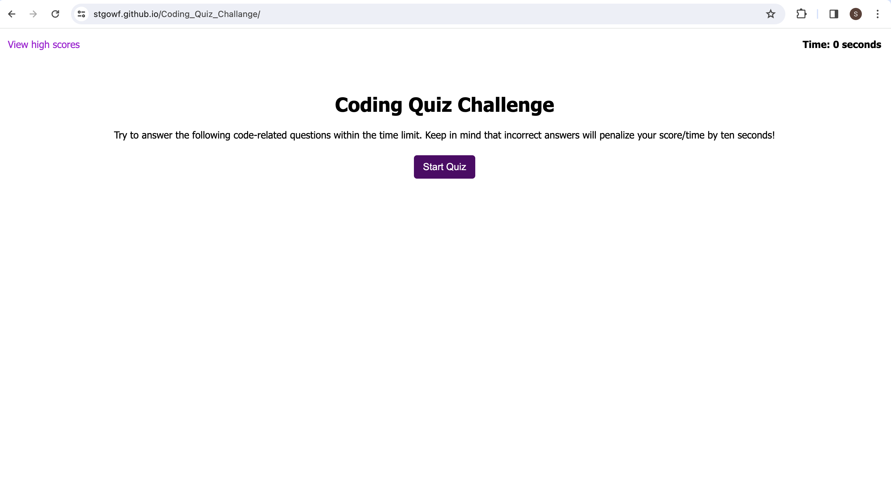

# Coding Quiz Challenge

## Overview
The Coding Quiz Challenge is an interactive web application designed to test your knowledge of programming fundamentals. Challenge yourself with a series of questions, improve your skills, and track your progress by saving your high scores!

## Features
- Dynamic, time-based quiz that tests your coding knowledge.
- Questions presented one at a time with multiple-choice answers.
- Timer penalization for incorrect answers to encourage accuracy under pressure.
- Score tracking and high score board to record top performers.

## Screenshot

## Deployment
Experience the live application [here](https://stgowf.github.io/Coding_Quiz_Challange/).

## Getting Started
To set up the quiz locally:
1. Clone the repository to your local machine.
2. Navigate to the cloned directory.
3. Open the `index.html` file in your preferred web browser.

## Contributing
Contributions are welcome! Please fork the repository and open a pull request with your proposed changes.

Thank you for visiting and we hope you enjoy the quiz!
